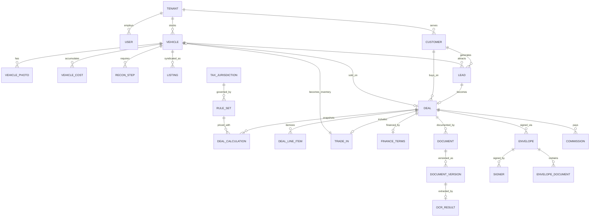

# MautoDesk — Phase 3: Database Design

**Status:** Applied and verified against PostgreSQL 16 · **Phase:** 3 of 13
**Source of truth:** `db/migrations/*.sql` — this document explains them, it does not duplicate them.

| Metric | Count |
| --- | --- |
| Tables | 68 |
| Indexes | 193 |
| RLS policies | 65 |
| RLS coverage gaps | **0** (`app.rls_coverage_gaps()` returns zero rows) |
| Isolation probe checks | **13 / 13 passing** (`db/tests/isolation_probe.sql`) |

---

## 1. Migration strategy: SQL-first, not EF-migrations-first

**Decision (ADR-0011, amending ADR-0001's data-access note).** Hand-authored, forward-only SQL
migrations in `db/migrations/` are the single source of truth for the schema. EF Core maps *to* that
schema with explicit `IEntityTypeConfiguration<T>` classes and generates no migrations.

**Why.** Everything that makes this schema safe is something EF Core migrations model poorly or not
at all: row-level security policies, `FORCE ROW LEVEL SECURITY`, append-only triggers, GiST exclusion
constraints, generated `tsvector` columns, partial and expression indexes, `GRANT`/`REVOKE`, and
role separation. Generating a migration and then hand-patching it produces a file that is neither
generated nor authored — the worst of both.

**How drift is prevented.** An integration test spins up the migrated schema in Testcontainers and
asserts that `dbContext.Database.GenerateCreateScript()`-equivalent model metadata matches the live
database (table names, column names, nullability, types). A model/schema mismatch fails the build.

**Runner.** DbUp, executing scripts in filename order against a `schema_version` journal table, run
as a migration role that is *not* `mautodesk_app`.

**Forward-only, expand/contract.** Every migration must be backward-compatible with the currently
deployed application for one release, so a deploy never needs downtime and a rollback never strands
the database ahead of the code. Destructive changes (dropping a column, tightening a constraint) are
a *separate, later* migration after the old code is gone.

---

## 2. Conventions

| Convention | Rule |
| --- | --- |
| Primary keys | `uuid` with `gen_random_uuid()`. High-volume append-only tables (`audit.event`, `crm.activity`, `app.outbox_message`, `inventory.vehicle_status_history`) use `bigint generated always as identity` — they are never referenced across a network boundary and the narrower key keeps their indexes small |
| Tenancy | `tenant_id uuid not null` on every tenant-owned table, plus an RLS policy and an `app.enforce_tenant()` trigger on the mutable aggregates |
| Timestamps | `timestamptz`, always. The database is UTC. There is no local-time column anywhere |
| Money | `numeric(14,2)`. Rates: `numeric(9,6)`. `float`/`double precision` appears in zero columns, and an architecture test blocks `double` from reaching `Sales.Domain` |
| Audit fields | `created_at/created_by`, `updated_at/updated_by`, `deleted_at/deleted_by` |
| Concurrency | PostgreSQL's system `xmin` column via Npgsql's `UseXminAsConcurrencyToken()`. No hand-maintained `row_version` column, so nothing can drift or be forgotten in a raw-SQL write path |
| Soft delete | `deleted_at is not null`. Unique indexes are partial: `where deleted_at is null` |
| Enums | `text` + `check` constraint, not PostgreSQL `enum` types. Adding a value is a one-line migration instead of a type alteration that locks |
| Naming | `snake_case`; indexes `<table>_<purpose>_ix`, unique `_uq`, checks `_ck`, FKs `_fk` |

**On `text` + `check` over native enums:** native enums cannot have values removed, reorder badly,
and require `ALTER TYPE` which historically could not run in a transaction with other DDL. A check
constraint is editable, greppable, and visible in `information_schema`.

---

## 3. Tenant isolation — how it is actually enforced

Four independent layers, so no single mistake is sufficient to leak data:

1. **RLS policy** — `using (tenant_id = app.current_tenant_id()) with check (same)`, applied by a
   loop over every table carrying a `tenant_id`, with `FORCE ROW LEVEL SECURITY` so even the table
   owner is subject to it.
2. **Fail-closed context** — `app.current_tenant_id()` returns `NULL` when `app.tenant_id` is unset,
   which makes every predicate `NULL` and therefore false. **No context means no rows**, never all
   rows. Verified by probe check 1.
3. **Immutability trigger** — `app.enforce_tenant()` rejects any attempt to write a row whose
   `tenant_id` differs from the session, and rejects changing `tenant_id` on an existing row.
   Verified by probe checks 4 and 5.
4. **Least-privilege role** — the application connects as `mautodesk_app`, which is not the table
   owner and does **not** have `BYPASSRLS`. Migrations run as a different role.

**The connection-context contract.** `app.tenant_id` is set with
`set_config('app.tenant_id', ..., true)` — the `true` makes it **transaction-local**, so a pooled
connection returned to the pool cannot carry context into the next request. `TenantConnectionInterceptor`
is the only place this is set, and it is the single most security-critical class in the codebase.

**Verification is automated, not periodic.**
- `app.rls_coverage_gaps()` reports any table that is missing RLS, missing `FORCE`, missing a policy,
  or missing a `tenant_id` without being declared exempt. The security suite asserts zero rows.
- `app.rls_exempt_table` is an explicit, reason-bearing allowlist. Adding a row is a visible act in
  code review — which is exactly the friction a "make this data cross-tenant" decision deserves.
- `db/tests/isolation_probe.sql` runs as `mautodesk_app` and attempts the attacks that matter.

**Exempt (shared reference) tables and why:** `inventory.vin_decode_cache` (public VIN data, no
customer information, and NHTSA rate limits are real), `sales.tax_jurisdiction`,
`sales.postal_jurisdiction`, `sales.rule_set` (published law), `identity.permission`, `billing.plan`.

---

## 4. Module map



The loop that closes the constitution's data flow: **`trade_in.received_vehicle_id` → `vehicle`**. A
trade taken on a deal becomes an inventory unit without anyone re-typing the VIN.

---

## 5. The five design decisions worth defending

### 5.1 Costs live in their own table

`inventory.vehicle_cost` is separate from `inventory.vehicle` because most independent dealers hide
acquisition and recon cost from salespeople. With a separate table, "the salesperson's view of a
vehicle" is a query that simply does not join costs — rather than a projection that the API layer
must remember to strip on every one of a dozen endpoints. The permission `inventory.cost.read` gates
the join; forgetting it produces missing data, not leaked data.

### 5.2 Deal money is a snapshot, not columns on the deal

`sales.deal` carries workflow state and zero monetary totals. Every number that can appear on a
contract lives in `sales.deal_calculation`, which is **append-only** (`UPDATE`/`DELETE` blocked by
trigger, verified by probe check 7) and stores:

- the exact serialized `input` the pure engine received,
- the exact serialized `output` it returned,
- the `rule_set_id` + `rule_set_version` + `engine_version` used,
- a `content_hash` printable on the contract,
- and a flat projection of the key figures for indexing and reporting.

A correction is a **new version** with the prior row marked `superseded_at`. This is what lets us
answer, three years into an audit, "what did the system compute on the day this was signed, and with
which rules?" — byte for byte. Denormalizing a total onto `sales.deal` would create a second source
of truth for the number a customer signed, which is the defect this design exists to prevent.

### 5.3 Tax rules are keyed to jurisdiction, versioned, and inert until approved

`sales.rule_set` is effective-dated and keyed to `tax_jurisdiction`, **not** to a state — Kansas
assesses destination-based local rates, so a state-keyed design would have needed a schema change
within months of launch. A GiST exclusion constraint makes overlapping approved periods impossible
for the same jurisdiction, so the engine can never face an ambiguous "which rules apply on this
date?" question.

`approved_at is null` rows are invisible to the engine. **The OK/KS/TX rule sets seeded in V0007 are
deliberately unapproved skeletons with `'UNVERIFIED'` placeholders and a `PLACEHOLDER` citation.**
The engine will refuse to price a deal until a reviewer populates them from primary sources and signs
off. That is a feature: shipping plausible-looking tax numbers sourced from nothing is how a DMS puts
a wrong figure on a signed retail contract.

### 5.4 The audit ledger is hash-chained, not just append-only

`audit.event` rows carry `prev_hash` and `hash`, forming a per-tenant chain computed by a `BEFORE
INSERT` trigger under a per-tenant advisory lock (so concurrent inserts cannot claim the same
predecessor). `UPDATE` and `DELETE` are revoked *and* blocked by trigger. `audit.verify_chain(tenant)`
walks a chain and returns any break; it runs on a schedule and alerts.

Append-only alone proves the application did not modify history. Chaining also detects modification
that bypassed the application — which is the threat model that matters after a database compromise.

### 5.5 Search is in the database, for now

`tsvector` generated columns with GIN indexes on `(tenant_id, search_vector)` via `btree_gin`, so a
search scan starts tenant-narrowed rather than scanning a global posting list. `pg_trgm` indexes on
VIN and stock number handle the single most common lot-floor query — a dealer typing the *middle* six
characters of a VIN, which a prefix index cannot serve.

This is `TD-002` in the debt register. The trigger to revisit is measured, not vibes: search p95
above 300 ms, or fuzzy-quality complaints.

---

## 6. Index strategy

Indexes were chosen against the actual read paths in `docs/02-architecture.md` §3, not speculatively.
Every index below answers a query a user will run many times a day.

| Query the user actually runs | Index |
| --- | --- |
| Inventory grid, filtered by status, sorted by age | `vehicle_tenant_status_ix (tenant_id, status, acquired_at desc)` |
| "Last six of the VIN" on the lot | `vehicle_vin_trgm_ix` GIN trigram |
| Faceted year/make/model browse | `vehicle_tenant_ymm_ix` |
| Public website feed | `vehicle_published_ix` — **partial**, only published + available rows |
| Free-text vehicle search | `vehicle_search_ix` GIN `(tenant_id, search_vector)` |
| "Which leads has nobody answered?" | `lead_unresponded_ix` — partial on `first_response_at is null` |
| My open tasks | `task_assigned_open_ix` — partial on open statuses |
| Deal pipeline board | `deal_open_ix` — partial on open statuses |
| Deal jacket contents | `document_deal_ix` |
| Customer/vehicle timeline | `activity_customer_ix`, `activity_vehicle_ix` |
| Outbox dispatcher | `outbox_pending_ix` — **partial on `dispatched_at is null`**, so the hot index stays tiny no matter how many millions of dispatched rows accumulate |
| Documents due for purge | `document_purgeable_ix` — partial, excludes legal holds |
| OCR review queue | `ocr_result_review_ix` — partial on low-confidence/failed |

**The pattern:** most hot queries are over a small, *filtered* subset (open, unread, pending,
published, undispatched). Partial indexes keep those indexes proportional to the working set rather
than to the table, which is what holds the sub-200 ms budget as a tenant's history grows.

**Every index is tenant-leading.** A non-tenant-leading index invites a plan that scans across
tenants before the RLS filter is applied — correct, but slow, and slow in a way that gets worse as
other tenants grow.

**Deliberately not indexed yet:** columns whose selectivity is unknown until real data exists. Adding
an index is cheap; a table carrying twenty unused indexes pays write cost on every insert forever.
Index additions after launch are driven by `pg_stat_statements`, not intuition.

---

## 7. Retention, deletion, and erasure — three different things

| Operation | Meaning | Mechanism |
| --- | --- | --- |
| **Soft delete** | User removed it from view; recoverable; still discoverable in audit and legally retained | `deleted_at` set; row remains |
| **Retention expiry** | The tenant's policy period has elapsed | `documents.document.retain_until` + `platform.retention_policy`; a purge job acts only when `purge_enabled` is true **and** `legal_hold` is false |
| **Erasure (GDPR/CCPA)** | The subject's data must genuinely cease to be readable | Crypto-shred: destroy the record's data keys in `app.encryption_key`, set `crm.customer.erased_at`, null the non-encrypted PII columns. Audit rows recording *that* the erasure happened survive by design |

**`purge_enabled` defaults to `false`.** Nothing is ever auto-deleted until a tenant explicitly opts
in, and a legal hold always wins over a retention policy. Deal jackets commonly carry a 4–7 year
state retention requirement; silently deleting one would be worse than keeping it too long.

**Soft delete is not erasure**, and treating them as the same is the most common way a system fails a
data-subject request while believing it complied.

---

## 8. What the schema does *not* do yet

Stated plainly so no one assumes coverage that isn't there:

- **No partitioning.** `audit.event`, `crm.activity`, and `messaging.message` are the eventual
  candidates (declarative range partitioning by month). Not needed at launch scale; the migration is
  planned but not written, because partitioning a table you haven't measured is guesswork.
- **No service department / repair orders.** Release 3.
- **No accounting journal entries.** The deal→journal mapping is designed for (`deal_calculation`
  carries everything a journal entry needs) but the tables land with the QuickBooks/Xero integration.
- **No Kansas county/city jurisdiction rows.** These load from a sourced dataset in a separate data
  migration. Hand-typing local tax jurisdictions into a seed file is exactly the failure mode §5.3
  exists to prevent.
- **No `platform.tenant` state beyond OK/KS/TX.** A check constraint enforces this. Widening it is a
  deliberate, per-state act gated on a reviewed rule set — the database refuses to onboard a dealer
  in a state we cannot price a deal in.

---

## 9. Running it yourself

```bash
docker run -d --name mautodesk-db -e POSTGRES_PASSWORD=devpw -e POSTGRES_DB=mautodesk -p 5432:5432 postgres:16-alpine
```

Apply migrations in filename order, then verify:

```bash
psql -h localhost -U postgres -d mautodesk -c "select * from app.rls_coverage_gaps();"
```

Zero rows is the only acceptable result. Then run the probe, which must end with
`=== ISOLATION PROBE PASSED ===`:

```bash
psql -h localhost -U postgres -d mautodesk -v ON_ERROR_STOP=1 -f db/tests/isolation_probe.sql
```

Both of these run in CI on every pull request. They are not a one-time exercise — they are the
regression guard that keeps ADR-0002 true as sixty-eight tables become two hundred.
